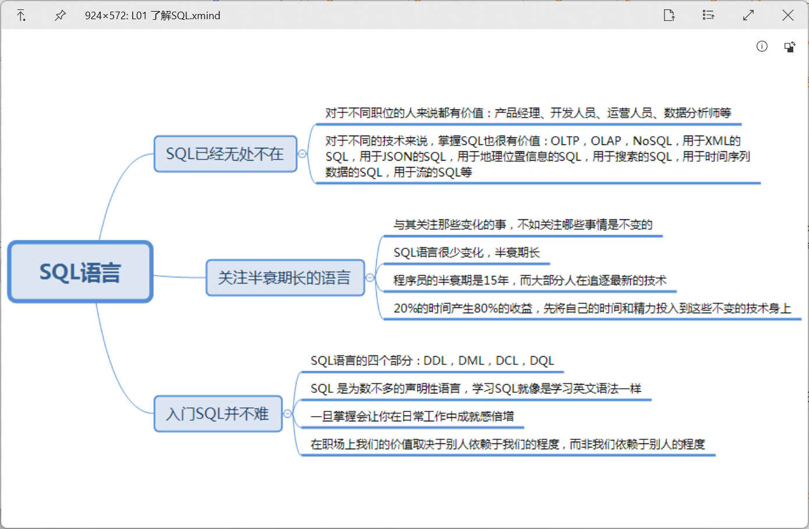

# QuickLook.Plugin.XMindViewer-Thumbnail

    
    
    

 

**Note**: *It will be blurred, if the `xmind` file is large*

# Method
- Extracting `thumbnail` file in `xmind`, and save it to plugin folder.
- Using `ImageViewer` to display the thumbnail file.

# Download and Installation
1. Go to [Release page](https://github.com/zhangkaihua88/QuickLook.Plugin.XMindViewer-Thumbnail/releases) and download the latest version.
2. Make sure that you have QuickLook running in the background. Go to your Download folder, and press Spacebar on the downloaded `.qlplugin` file.
3. Click the "Install" button in the popup window.
4. Restart QuickLook.
5. Select the file(`.xmind`) and press Spacebar.

# Thanks to
- [QuickLook.Plugin.ImageViewer](https://github.com/QL-Win/QuickLook/)